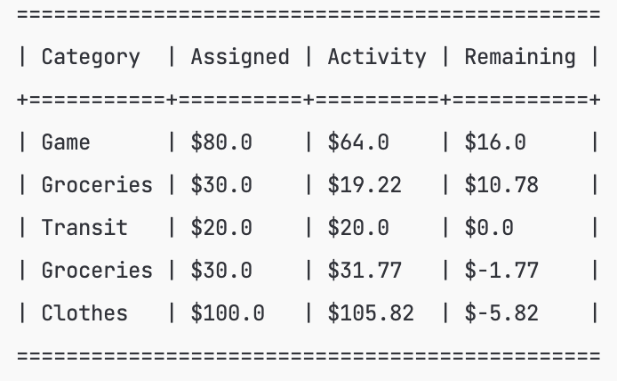
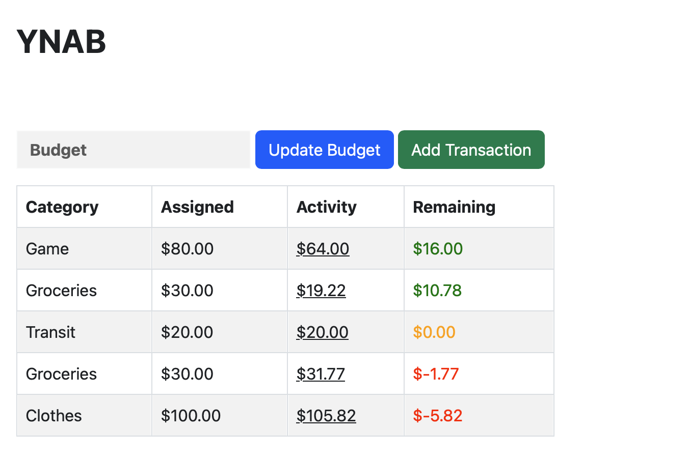

# Homework #6:  Database, Servlets and FreeMarker

## Tests
### Budget Loader

~~~bash
compile exec:java -Dexec.mainClass=edu.bhcc.BudgetLoader
~~~

### Budget Terminal Display

~~~bash
compile exec:java -Dexec.mainClass=edu.bhcc.BudgetDisplayTool
~~~

**Effect**:

### Budget HTML Display

~~~bash
mvn jetty:run
~~~

**Effect**:

