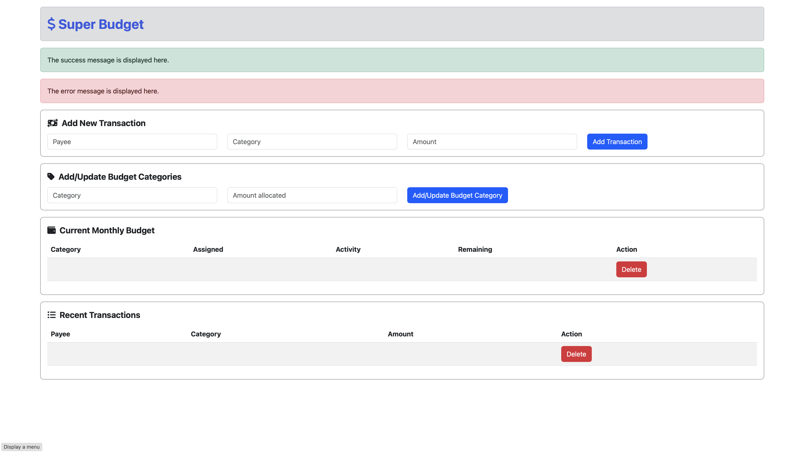

# Super Budget

## Basic Information

* **Project name**: Super Budget
* **Group member**: Zhuojian Chen (James) (Individual Project)
* **Environment**:
    * Java: `19.0.2`
    * Maven: `3.9.1`
    * MySQL: `8.0.32`

> Statement \
> This project is intended to be developed by the author without utilizing AI-based tools such as Copilot and ChatGPT.
> All references for this project are listed in the end of this document.

> Intention \
> Develop a robust, highly available, and scalable web-based budgeting application that adheres to industry best
> practices. The project structure should be designed to optimize performance and maintainability, while avoiding the
> inclusion of overkilling and overly complex features. 😋

> Javadoc and Comments \
> For this project, elaborated Javadoc and comments will be added to classes, fields, methods, and code blocks,
> except the following cases:
> * Ordinary getters and setters in classes annotated by `@JavaBean` or `@Entity`.
> * Fields in model classes annotated by `@Entity`. Because the comment of fields in model classes are written inside
    the `@Comment` annotation.
> * Override methods.
> * Constructors annotated by `@Autowired` in Spring bean classes.
> * Test methods in test classes.

## Project Structure

~~~
. (<root>/src)
├── main
│   ├── java
│   │   └── edu.bhcc.superbudget
│   │       ├── SuperBudgetApplication.java
│   │       ├── SuperBudgetConfiguration.java
│   │       ├── SuperBudgetInterceptor.java
│   │       ├── controller
│   │       │   ├── CategoryController.java
│   │       │   ├── IndexController.java
│   │       │   └── TransactionController.java
│   │       ├── dto
│   │       │   ├── BudgetDto.java
│   │       │   └── TransactionDto.java
│   │       ├── exception
│   │       │   ├── CategoryNotFoundException.java
│   │       │   └── TransactionNotFoundException.java
│   │       ├── model
│   │       │   ├── Category.java
│   │       │   └── Transaction.java
│   │       ├── repository
│   │       │   ├── CategoryRepository.java
│   │       │   └── TransactionRepository.java
│   │       └── service
│   │           ├── CategoryService.java
│   │           └── TransactionService.java
│   └── resources
│       ├── application.properties
│       ├── static
│       └── templates
│   │       └── service 
└── test
    └── java.edu.bhcc.superbudget
        └── SuperBudgetServiceTests.java
~~~

The application adheres to a commonly used naming convention and folder structure. The entry point of the application is
the `SuperBudgetApplication` class. Configuration settings, including Spring beans (although none are registered here),
and overridden methods for `WebMvcConfigurer`, are stored in `SuperBudgetConfiguration`. The controller folder holds
three classes responsible for managing HTTP requests. A basic routing mechanism for static resources can be found in the
`IndexController` class. The dto folder contains the data transfer objects (DTO) utilized by Thymeleaf. The model folder
contains the entity classes, also known as models. JPA repositories are kept in the repository folder, while the service
folder houses two service classes that act as intermediaries between the controller and model layers.

> Foreign Key Constraint \
>  I decided not to utilize `@OneToMany` and `@ManyToOne` annotations to minimize the usage
> of "join" clauses in my SQL, which may negatively impact performance. For instance, when retrieving a transaction
> record, using these annotations would automatically join the category table and fetch the corresponding category
> record. However, if the category table contains numerous fields, this could significantly slow down the query speed.
> Additionally, using these annotations can make it difficult to expand the business logic and maintain the codebase in
> the future. **However, I still put them into my code in the form of comment in model classes.**  \
> **In order to make it perfect, I just implemented `@OneToMany` and `@ManyToOne`.**

> Implementation of Button Events \
> As I am not well-versed in Thymeleaf, and considering the trend of separating frontend and backend, I have decided to
> avoid using it too much. Instead, I used Javascript for URL redirection, as it better aligns with my preferences for
> frontend development.

## Application Properties

This project has only one `.properties` file, which is the default `application.properties`. The following is the
explanation for each property.

~~~properties
# The log asks to disable it to avoid warning.
spring.jpa.open-in-view=false
# Disable the annoying banner.
spring.main.banner-mode=off
# Prints SQL statements on the terminal.
spring.jpa.show-sql=true
# To facilitate testing, the item is set to "create", which instructs Hibernate to 
# drop all tables and create new ones each time the application or test is run.
spring.jpa.hibernate.ddl-auto=create
# The url of the database.
spring.datasource.url=jdbc:mysql://localhost:3306/budget
# The username of the database user.
spring.datasource.username=user
# The password of the database user.
spring.datasource.password=password
~~~

## Testing

To properly set up the testing environment, it is required to have the following components:

* Java version `19.0.x` or newer.
* Maven version `3.8.x` or newer.
* MySQL service version `8.0.32` that is running.

Before conducting any tests, it is mandatory for the testers to update the `application.properties` file by filling in
the relevant database URL, username, and password fields. After updating the properties file, testers must navigate to
the project root directory and execute the following command to install dependencies and clean the project:

~~~bash
mvn clean install
~~~

After all preparation is completed, execute the following command to run the unit tests:

~~~bash
mvn test
~~~

If all unit tests have been passed, you may start the application by executing the following command:

~~~bash
mvn spring-boot:run
~~~

Upon successful execution of the command, the application will start listening on port `8080` if the port is available.

## Notice

<s>I am unsure of the reason, but I have noticed that the icons display correctly when I run the index.html file using
IntelliJ. However, when I run the Spring application and access the index page via `localhost:8080`, the icons do not
display properly. Although this does not affect the functionality of the application, it does not look aesthetically
pleasing. Here is an example of how it should appear:</s>

I haven't resolved the issue, but I have made changes so that the font-awesome CSS file is now being loaded from the
internet. **This means that testers will need to be connected to the internet when testing.**

## References

1. [Google Java Style Guide](https://google.github.io/styleguide/javaguide.html)
2. [Java - Documentation Comments](https://www.tutorialspoint.com/java/java_documentation.htm)
3. [16 Best Practices for Spring Boot in Production](https://www.springcloud.io/post/2022-08/springboot-best-practices)
4. [Advanced Spring Data JPA - Specifications and Querydsl](https://spring.io/blog/2011/04/26/advanced-spring-data-jpa-specifications-and-querydsl)
5. [Thymeleaf Documentation](https://www.thymeleaf.org/documentation.html)
6. [How to truncate a foreign key constrained table?](https://stackoverflow.com/questions/5452760/how-to-truncate-a-foreign-key-constrained-table)
7. [How to get domain name from URL in JavaScript](https://www.javatpoint.com/how-to-get-domain-name-from-url-in-javascript#:~:text=The%20most%20straightforward%20way%20to,location.)
8. [Spring Data JPA @Query](https://www.baeldung.com/spring-data-jpa-query)
9. [Introduction to Spring MVC HandlerInterceptor](https://www.baeldung.com/spring-mvc-handlerinterceptor)
10. [Read all text from a file into a String in Java](https://www.techiedelight.com/read-all-text-from-file-into-string-java/#:~:text=To%20read%20all%20the%20bytes,with%20a%20charset%20for%20decoding)
11. [Common MIME types](https://developer.mozilla.org/en-US/docs/Web/HTTP/Basics_of_HTTP/MIME_types/Common_types)
12. [Error Handling for REST with Spring](https://www.baeldung.com/exception-handling-for-rest-with-spring)